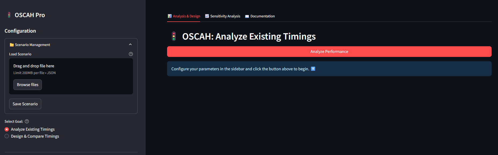
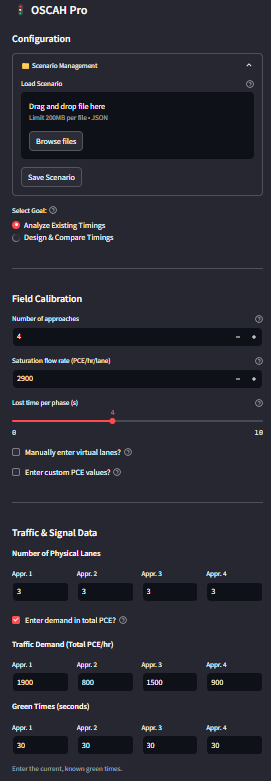

# OSCAH Pro - Optimal Signal Control & Analysis

OSCAH Pro (Optimal Signal Control and Analysis for Heterogeneous and Lane-Free Traffic) is a **Streamlit web application** designed for traffic engineers, planners, and researchers. It provides a platform to analyze the performance of existing traffic signal timings and to design new, optimized signal plans for isolated intersections, with a special focus on heterogeneous and lane-free traffic conditions.



---

## Table of Contents
- [Features](#features)
- [Core Concepts & Formulas](#core-concepts--formulas)
- [Getting Started](#getting-started)
- [User Guide](#user-guide)
- [Building the Executable](#building-the-executable)
- [Troubleshooting](#troubleshooting)

---

## Features

### Dual-Mode Operation
- **Analysis Mode**: Evaluate the performance (delay, Level of Service) of existing, known signal timings.
- **Design Mode**: Design a new signal plan using the specialized OSCAH model and compare it against a baseline.

### Advanced Inputs
- Full control over parameters like saturation flow, lost time, physical and virtual lanes, and custom Passenger Car Equivalent (PCE) values.

### Scenario Management
- Save and load complete intersection configurations to a `.json` file for easy record-keeping and sharing.

### Sensitivity Analysis
- Analyze how intersection delay changes in response to variations in a single input parameter.

### Comprehensive Reporting
- Generate and download a summary report of inputs and results in Markdown format.

### Rich Visualizations
- Interactive bar charts and radar plots to easily compare performance across different scenarios.

---

## Core Concepts & Formulas
This tool is built on established traffic engineering principles.

### Key Terminology
- **Saturation Flow Rate (s)**: The maximum number of vehicles (in PCE) that can pass through an intersection approach per hour if the signal light were green for the entire hour.
- **Passenger Car Equivalent (PCE)**: A factor used to convert different vehicle types into a standard unit.
- **Virtual Lanes (n)**: A concept to model lane-free traffic where vehicles form more parallel queues than the number of physical lanes.
- **Level of Service (LOS)**: A standardized letter grade (A–F) that describes the operating conditions of an intersection based on average delay.

### Key Formulas

**Approach Delay Model**  
The total delay (*d*) for an approach is the sum of uniform delay (*d₁*), random delay (*d₂*), and an empirical adjustment term (*d₃*).

$$d = d_1 + d_2 + d_3$$

**Uniform Delay (d₁):**

$$d_1 = 0.5 \cdot C \cdot \frac{(1 - \lambda)^2}{1 - (v/s)}$$

**Random Delay (d₂):**

$$d_2 = \frac{X^{\sqrt{2(n+1)}}}{2n\lambda(1-X)}$$

**Empirical Adjustment (d₃):**

$$d_3 = 4.84\lambda - 13.15$$

Where:  
- *C* = Cycle Length  
- *λ* = Green Ratio (g/C)  
- *v* = Traffic Volume  
- *s* = Saturation Flow  
- *X* = Degree of Saturation  
- *n* = Virtual lanes

---

### OSCAH Cycle Length Model (Coscah)

An empirical formula that adjusts the cycle length based on the intersection's saturation flow rate and overall traffic intensity (*Y*).

$$
C_{oscah} = \begin{cases} 
\left\lceil \frac{1-Y}{1.72L+2.4} \right\rceil & 2000 \leq s < 2500 \text{ and } Y \leq 0.7 \\
\left\lceil \frac{1-Y}{1.65L+2.61} \right\rceil & 2000 \leq s < 2500 \text{ and } Y > 0.7 \\
\left\lceil \frac{1-Y}{1.61L+2.27} \right\rceil & 2500 \leq s \leq 3000 \text{ and } Y \leq 0.7 \\
\left\lceil \frac{1-Y}{1.55L+2.31} \right\rceil & 2500 \leq s \leq 3000 \text{ and } Y > 0.7 \\
\left\lceil \frac{1-Y}{1.5L+5} \right\rceil & \text{otherwise}
\end{cases}
$$

Where:  
- *L* = Total lost time  
- *Y* = Sum of critical flow ratios (v/s)  
- *s* = Saturation flow rate per lane

---

## Getting Started

To run this application on your local machine, you will need **Python 3.8+** installed.

### 1. Clone the Repository
```bash
git clone https://github.com/your-username/oscah-pro.git
cd oscah-pro
```

### 2. Create a Virtual Environment
It is highly recommended to use a virtual environment to manage dependencies.

```bash
# Create the venv
python -m venv venv

# Activate the venv
# On Windows:
venv\Scripts\activate
# On macOS/Linux:
source venv/bin/activate
```

### 3. Install Dependencies
The `requirements.txt` file lists all the necessary Python libraries.

```bash
pip install -r requirements.txt
```

### 4. Run the App
Once the dependencies are installed, you can launch the application.

```bash
streamlit run oscah_app.py
```

The application should automatically open in a new tab in your default web browser.

---

## User Guide

The application is organized into a **sidebar** for inputs and a **main panel** with tabs for results and documentation.



- **Scenario Management**: Save your current configuration to a `.json` file or load a previously saved file.
- **Select Goal**: Choose between "Analyze Existing Timings" or "Design & Compare Timings". The sidebar inputs will adapt based on your choice.
- **Configure Parameters**: Enter required data, including Field Calibration, Traffic Data, and Green Times. Tooltips (`?`) provide help for each parameter.
- **Run Analysis**: Click the main button (e.g., "Analyze Performance") to run calculations.
- **Interpret Results**: Metrics, tables, and charts appear in the *Analysis & Design* tab.
- **Sensitivity Analysis (Optional)**: Explore how changes in one variable affect overall performance in the *Sensitivity Analysis* tab.

---

## Building the Executable

You can package this application into a standalone executable (`.exe`) for Windows so it can be run on machines without Python installed.

### 1. Install the Packager
```bash
pip install streamlit-desktop-app
```

### 2. Run the Build Command
```bash
streamlit-desktop-app build oscah_app.py --name OSCAH --pyinstaller-options --onefile --windowed
```


### 3. Locate the Executable
The final `.exe` file will be located in the newly created **dist** folder.

---

## Troubleshooting

**Error: `Intersection Over Capacity!`**  
This is the most common error. It means the traffic demand you entered is greater than the physical capacity of the intersection (Σv/s ≥ 1).

**Solution:** Reduce traffic demand values, or increase capacity by adding more lanes or increasing the saturation flow rate.

---
